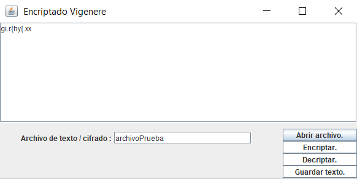

# Encriptdo-Vigenere

Problematica que se desarrollo:

Se desarrollo un programa que implemento una aplicación con GUI para el cifrado de archivos de texto con el algoritmo de cifrado Vigenère.

Se creo un programa de cifrado simple. El proceso es muy sencillo. Se divide en dos partes. En primer lugar, cada letra mayúscula o minúscula debe desplazarse tres posiciones hacia la derecha, de acuerdo con la tabla ASCII: la letra ’a’ debe convertirse en la letra ’d’, la letra ’y’ debe convertirse en el carácter ’—’, etc. En segundo lugar, cada línea debe invertirse. Después de invertir, todos los caracteres de la mitad en adelante (truncado) deben moverse una posición a la izquierda en ASCII. En este caso, ’b’ se convierte en ’a’ y ’a’ se convierte en ’‘’.

Por ejemplo, si como entrada tenemos la cadena abcABC1 si la palabra resultante de la primera parte es ”defDEF1”, las letras ”DEF1”deben moverse una posición a la izquierda. Sin embargo, si la palabra resultante de la primera parte es ”tesA”, las letras ”sA”serán desplazadas. El resultado cifrado de la cadena es 1FECedc.

# Link de funcionamiento

# Pre-Requisitos

Para este programa se ocupan librerias propias del lenguaje JAVA (no se ocupo ninguna libreria externa), el repositorio de GitHub y yo use un IDE. Eclipse 2020-06.

# Elementos visuales y funcionmiento

1.- Guardar(Se almacena la informacion en el archvio).

2.- Encripta(Se aplica el metodo usado para encriptar).

3.- Desencriptar(Se revierte el efecto de encriptar para obtener el texto original).

4.- Abrir archivo(Se busca el nombre del archivo que se ingreso antes para ver la informacion almacenada).

5.- Se coloca los datos en el textArea para poder empezar a trabajar.

# Pruebas

Texto #3

abcABC1

vxpdylY .ph

vv.xwfxo.fd

-Cadenas resultantes (respectivamente)

3# rvzgV

1FECedc

ks. \n{frzx

gi.r{hyz-xx.

# Agradecimientos

~ Carlos Rafael Levy Rojas (Docente de la materia: Topicos Avanzados de Programacion. del Instituto Tecnologico de León ) Por guiarnos y alentarnos a realizar este proyecto

~ A mi: Por mi esfuerzo y dedicacion para poder realiar este proyeto

# Referencias

~Libro: Como programar en Java 

~https://anabelisa.co/readme/

# Resultado

